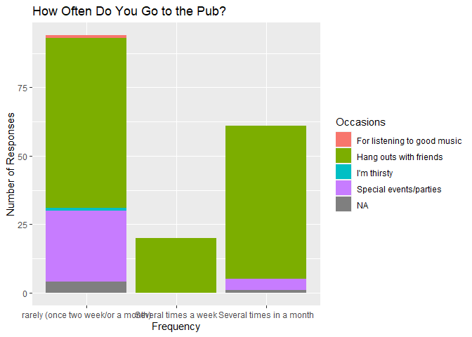
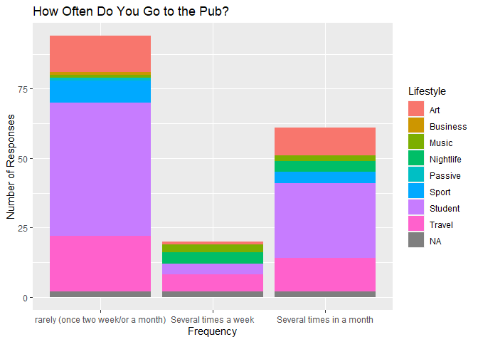
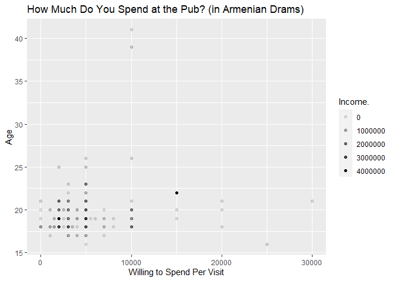

Analysis of the Armenian Pub Survey Data in R Markdown
================
Brian Buonauro

## Objective

The purpose of this analysis is to provide a demonstration of linear
regression, plotting, and cleaning of survey data in R, presented in R
Markdown.

## Loading the Packages

The only package used for this analysis was tidyverse.

``` r
library(tidyverse)
```

    ## ── Attaching packages ─────────────────────────────────────── tidyverse 1.3.2 ──
    ## ✔ ggplot2 3.4.0      ✔ purrr   0.3.5 
    ## ✔ tibble  3.1.8      ✔ dplyr   1.0.10
    ## ✔ tidyr   1.2.1      ✔ stringr 1.4.1 
    ## ✔ readr   2.1.3      ✔ forcats 0.5.2 
    ## ── Conflicts ────────────────────────────────────────── tidyverse_conflicts() ──
    ## ✖ dplyr::filter() masks stats::filter()
    ## ✖ dplyr::lag()    masks stats::lag()

## Loading the Dataset

Data was sourced from a
[Kaggle](https://www.kaggle.com/datasets/erikhambardzumyan/pubs) user
@ErikHambardzumyan and was collected during late February and early
March of 2017 from 175 people in Armenia regarding their habits around
going to pubs.

## Cleaning the Dataset

The unique() function was used on all columns to observe differences in
responses and formulate a plan for cleaning the dataset. The following
columns were found to need minor cleaning to make the data easier to
understand and draw conclusions from: X.Occupation, Fav_Pub, Lifestyle,
and Occasions.

------------------------------------------------------------------------

``` r
data$X.Occupation <- trimws(data$X.Occupation)
```

The X.Occupation column only needed trailing whitespace trimmed.

------------------------------------------------------------------------

``` r
data$Fav_Pub <- trimws(data$Fav_Pub)
data$Fav_Pub[data$Fav_Pub == "BullDog"] <- "Bulldog"
data$Fav_Pub[data$Fav_Pub == "Do not have one"] <- NA
data$Fav_Pub[data$Fav_Pub == "I don't like pubs"] <- NA
data$Fav_Pub[data$Fav_Pub == "I have none"] <- NA
data$Fav_Pub[data$Fav_Pub == "37 pub"] <- "Pub 37"
data$Fav_Pub[data$Fav_Pub == "Tom collins"] <- "Tom Collins"
data$Fav_Pub[data$Fav_Pub == "Void"] <- NA
data$Fav_Pub[data$Fav_Pub == "VOID"] <- NA
```

The Fav_Pub column needed trailing whitespace trimmed, duplicates
merged, and string values indicating the respondent had no opinion
switched to a value of NA.

------------------------------------------------------------------------

``` r
data$Lifestyle <- trimws(data$Lifestyle)
data$Lifestyle[data$Lifestyle == "Busy(student life, work)"] <- "Student"
data$Lifestyle[data$Lifestyle == "Sport, art, traveling"] <- "Sport"
data$Lifestyle[data$Lifestyle == "Adventure/traveling/exploring"] <- "Travel"
data$Lifestyle[data$Lifestyle == "Rock, punk"] <- "Music"
data$Lifestyle[data$Lifestyle == "Business, sports, dance"] <- "Business"
```

The Lifestyle column needed trailing whitespace trimmed and answers
simplified to the primary response.

------------------------------------------------------------------------

``` r
data$Occasions <- trimws(data$Occasions)
data$Occasions[data$Occasions == "Never"] <- NA
data$Occasions[data$Occasions == "Nowere"] <- NA
data$Occasions[data$Occasions == "For listening  good music"] <- "For listening to good music"
data$Occasions[data$Occasions == "Birthdays"] <- "Special events/parties"
data$Occasions[data$Occasions == "chem aycelum"] <- "I'm thirsty"
```

The Occasions column needed whitespace trimmed, duplicates merged,
string values indicating the respondent had no opinion switched to a
value of NA, and a value needed to be translated to English. The string
value “chem aycelum” (transliterated to ծհեմ այծելuմ in the Armenian
alphabet) roughly translates to “I’m thirsty” in English from Armenian
per an online search.

------------------------------------------------------------------------

## Table Statistics & Plots

``` r
summary(data)
```

    ##   Timestamp              Age.         Gender.             Income.       
    ##  Length:175         Min.   :16.00   Length:175         Min.   :      0  
    ##  Class :character   1st Qu.:18.00   Class :character   1st Qu.:    100  
    ##  Mode  :character   Median :19.00   Mode  :character   Median :  55000  
    ##                     Mean   :19.55                      Mean   : 110198  
    ##                     3rd Qu.:20.00                      3rd Qu.: 100000  
    ##                     Max.   :41.00                      Max.   :4500000  
    ##                                                        NA's   :1        
    ##  X.Occupation         Fav_Pub               WTS            Freq          
    ##  Length:175         Length:175         Min.   :    0   Length:175        
    ##  Class :character   Class :character   1st Qu.: 2000   Class :character  
    ##  Mode  :character   Mode  :character   Median : 4000   Mode  :character  
    ##                                        Mean   : 4831                     
    ##                                        3rd Qu.: 5000                     
    ##                                        Max.   :30000                     
    ##                                        NA's   :3                         
    ##    Prim_Imp           Sec_Imp            Stratum           Lifestyle        
    ##  Length:175         Length:175         Length:175         Length:175        
    ##  Class :character   Class :character   Class :character   Class :character  
    ##  Mode  :character   Mode  :character   Mode  :character   Mode  :character  
    ##                                                                             
    ##                                                                             
    ##                                                                             
    ##                                                                             
    ##   Occasions        
    ##  Length:175        
    ##  Class :character  
    ##  Mode  :character  
    ##                    
    ##                    
    ##                    
    ## 

``` r
data %>% ggplot() + geom_col(aes(x = Freq, y = frequency(Freq), fill = Occasions)) +
  labs(title = "How Often Do You Go to the Pub?", 
       x = "Frequency", y = "Number of Responses")
```

<!-- -->

Observations:

- To “Hang out with friends” was the only response for respondents who
  also answered that they frequent pubs several times per week.

- Responses of “For listening to good music”, “I’m thirsty”, and
  “Special events/parties” were most prevalent reasons for visiting pubs
  among respondents who answered that they rarely go to pubs.

``` r
data %>% ggplot() + geom_col(aes(x = Freq, y = frequency(Freq), fill = Lifestyle)) +
  labs(title = "How Often Do You Go to the Pub?", 
       x = "Frequency", y = "Number of Responses")
```

<!-- -->

Observations:

- Respondents who answered “Nightlife” to a question about their
  lifestyle were likely to frequent pubs more than just rarely.

- Respondents who answered “Sport” to a question about their lifestyle
  were less likely to frequent pubs.

``` r
data %>% ggplot() + geom_point(aes(x = WTS, y = Age., alpha = Income.)) +
  labs(title = "How Much Do You Spend at the Pub? (in Armenian Drams)", 
       x = "Willing to Spend Per Visit", y = "Age")
```

    ## Warning: Removed 3 rows containing missing values (`geom_point()`).

<!-- -->

Observations:

- Older and wealthier respondents appear to have more reserved spending
  habits.

- Most respondents are young and spend 10,000 Dram (\~\$25 USD) or less
  on a trip to the pub.

- Young and low income appear to be over-sampled in this dataset.

## Quantifying Qualitative Data for Regression Analysis

``` r
data$gender_int <- NA
data$gender_int[data$Gender. == "Male"] <- 0
data$gender_int[data$Gender. == "Female"] <- 1
#purpose: detecting the influence of gender on spending

data$occupation_int <- 0
data$occupation_int[data$X.Occupation == "Student + working"] <- 1
data$occupation_int[data$X.Occupation == "Student"] <- 1 
#purpose: detecting the influence of student status on spending

data$freq_int[data$Freq == "rarely (once two week/or a month)"] <- 0
data$freq_int[data$Freq == "Several times in a month"] <- 1
data$freq_int[data$Freq == "Several times a week"] <- 1
#purpose: detecting the influence of frequency at pubs on spending
```

## Regression Analysis

``` r
model1 <- lm(WTS ~ Age. + Income. + gender_int + occupation_int + freq_int, data = data)
summary(model1)
```

    ## 
    ## Call:
    ## lm(formula = WTS ~ Age. + Income. + gender_int + occupation_int + 
    ##     freq_int, data = data)
    ## 
    ## Residuals:
    ##     Min      1Q  Median      3Q     Max 
    ## -6134.9 -2218.6  -842.9   883.1 26217.9 
    ## 
    ## Coefficients:
    ##                     Estimate    Std. Error t value Pr(>|t|)  
    ## (Intercept)     7102.4085860  3820.3195920   1.859   0.0648 .
    ## Age.              39.1057694   138.3884004   0.283   0.7779  
    ## Income.            0.0016854     0.0009677   1.742   0.0834 .
    ## gender_int     -1645.1423795   656.5977024  -2.506   0.0132 *
    ## occupation_int -2125.8625462  1619.4100934  -1.313   0.1911  
    ## freq_int        -572.7431990   640.9041188  -0.894   0.3728  
    ## ---
    ## Signif. codes:  0 '***' 0.001 '**' 0.01 '*' 0.05 '.' 0.1 ' ' 1
    ## 
    ## Residual standard error: 4147 on 165 degrees of freedom
    ##   (4 observations deleted due to missingness)
    ## Multiple R-squared:  0.1102, Adjusted R-squared:  0.08326 
    ## F-statistic: 4.088 on 5 and 165 DF,  p-value: 0.00159

From the regression model, we can see that age and income actually have
no substantial effect on the Willingness to Spend variable y. We see
that the gender, occupation, and frequency variables had strong negative
influences on Willingness to Spend variable y. This was expected since I
isolated students (who tend to have lower income or no income) in the
occupation variable, isolated women (who tend to have a lower tolerance
to alcohol then men meaning they would spend less at a pub) in the
gender variable, and isolated respondents who go to pubs more often in
the frequency variable.

## Conclusion

Overall, this dataset is not reliable enough to make a pronouncement
about the usage of pubs in Armenia in general and another survey with a
larger range of demographic characteristics would be needed. We have no
location information besides the origin (data\$Stratum) of the
participants of the survey. There also is an over-sampling of the young
and low income as previously mentioned, and the times of the survey
datapoints do not reflect a diverse range of times. Additionally, this
data has not been vetted by peers on Kaggle and it cannot be certain
what sampling methods were used to gather the data. Due to these flaws
in the data and lack of clarity about collection methods, there are
likely issues with the results of the regression model in the section
above.
